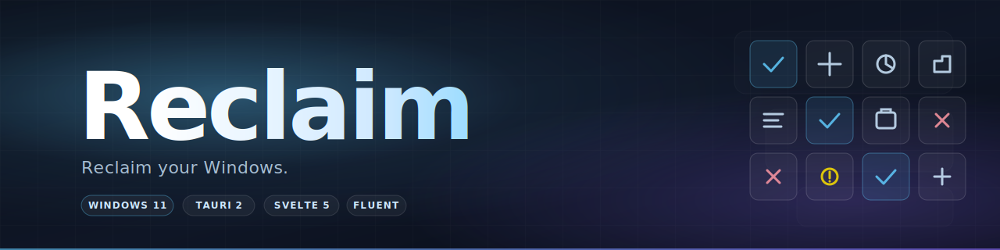

<div align="center">



A modern, safe Windows 11 tweaker built with **Tauri 2 + Svelte 5** and a **Fluent / Mica** UI.

[](https://github.com/jonax1337/reclaim/actions/workflows/build.yml)
[](https://github.com/jonax1337/reclaim/actions/workflows/release.yml)
[](LICENSE)


</div>

## Features

- **Privacy & Telemetry** — disable diagnostic data, advertising ID, tailored experiences, activity history, feedback prompts.
- **Bloatware** — uninstall pre-installed UWP apps (Bing News/Weather, Solitaire, Get Office, Get Help, Feedback Hub, Groove, Movies & TV, Xbox suite, Widgets) for **all users + provisioned** — they don't come back on new accounts.
- **AI** — disable Windows Copilot, uninstall the Copilot app, disable Recall (24H2+).
- **Explorer** — show file extensions, show hidden files, classic right-click menu, taskbar-left, kill Bing in Start Menu.
- **Performance** — visual-effects best-perf, no startup delay, Ultimate Performance power plan.
- **Services** — disable Remote Registry / ICS / Offline Files, set MapsBroker manual, etc.
- **Install Apps** — curated `winget` list (browsers, dev tools, media, comms, gaming, security) with one-click silent install.

Every tweak shows what it does, has a **severity badge** (Safe / Caution / Risky), and is **fully reversible**:

- Per-tweak backup is stored in `%APPDATA%\Reclaim\backups\<id>.json` (registry snapshots, prior service start type, removed AppX names) so reverting works after restarts.
- Optional **System Restore Point** before each batch (`Checkpoint-Computer`).

---

## Download

Grab the latest installer from the [**Releases**](https://github.com/jonax1337/reclaim/releases) page:

- `Reclaim_<version>_x64-setup.exe` — NSIS installer (recommended)
- `Reclaim_<version>_x64_en-US.msi` — MSI installer (for managed deployments)

**Run as Administrator.** Reclaim needs admin for HKLM writes, service config, and provisioned AppX removal. The Dashboard shows a yellow "Not admin" badge if you forget.

---

## Architecture

| Layer    | Tech                                              |
|----------|---------------------------------------------------|
| Window   | Tauri 2 with **Mica** effect + transparent BG     |
| Frontend | **Svelte 5 (runes)** + TypeScript + SvelteKit static adapter |
| Backend  | **Rust** — `winreg` for registry, `sc.exe` for services, **PowerShell only for AppX/DISM** (no Win32 equivalent for `Get-AppxPackage`) |
| Catalog  | **Declarative TOML** under `src-tauri/tweaks/`, embedded at compile time. Each tweak: `id`, `category`, `severity`, `presets[]`, `min_build/max_build`, `registry[]`, `services[]`, `appx[]`, `ps_apply`, `ps_revert`, `warning` |

Inspired by the data-driven approach of [ChrisTitusTech/winutil](https://github.com/ChrisTitusTech/winutil) and the cleanly separated regfiles of [Raphire/Win11Debloat](https://github.com/Raphire/Win11Debloat).

---

## Build from source

**Prerequisites**

- **Node 20+** and npm
- **Rust** (`rustup default stable`)
- **Visual Studio 2022 Build Tools** with the *Desktop development with C++* workload
- **WebView2 Runtime** (preinstalled on Windows 11)

**Build**

```powershell
# install JS deps
npm install

# dev (hot-reloads Svelte; restarts Rust on Cargo.toml change)
npm run tauri dev

# release build → src-tauri/target/release/bundle/{nsis,msi}/
npm run tauri build
```

---

## Safety notes

- This tool only writes to **registry**, **services**, and **AppX**. It **never** disables Defender, SmartScreen, or update services — that is where other debloaters have caused real damage.
- The **Risky** badge requires explicit per-tweak opt-in (no preset enables them by default).
- All batch operations create a **system restore point** by default (toggle in the Apply bar).
- Use at your own risk. Take a restore point. Read what each tweak does before applying.

---

## Contributing

Issues and PRs welcome. New tweaks are declared as TOML in `src-tauri/tweaks/` — open any of the existing files (`privacy.toml`, `explorer.toml`, …) to see the schema, copy a block, and adjust `id`, `name`, `description`, `severity`, and the registry/service/appx targets. Translations and build-version gating (`min_build` / `max_build`) are also appreciated.

Please run `npm run check` and `cargo fmt` before opening a PR.

---

## License

[MIT](LICENSE) © 2026 Jonas Laux
